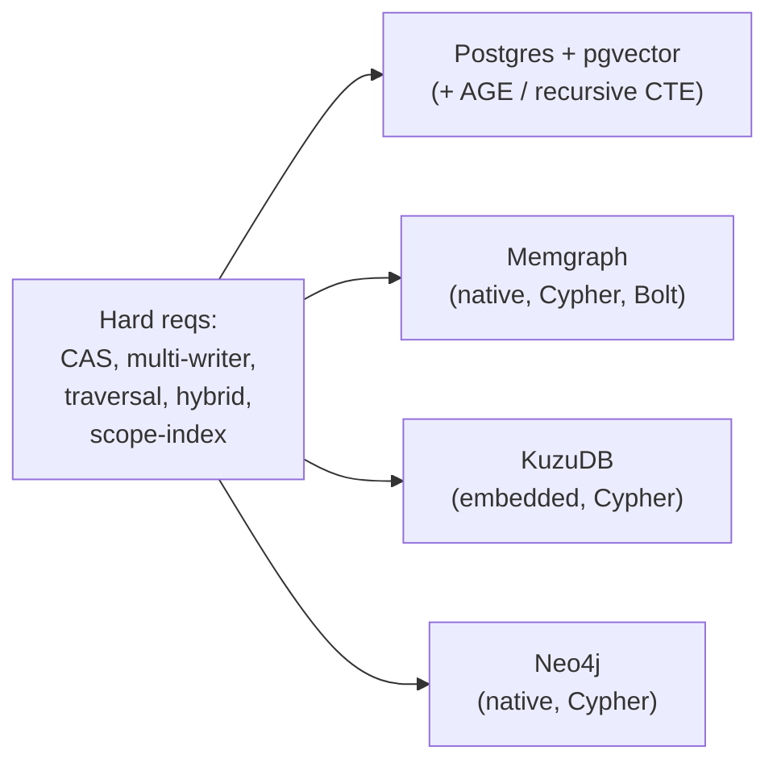

# Storage Engine Spike

> Decision spike for the one foundational pick in
> [`system_architecture.md`](system_architecture.md) §7: the graph + vector
> engine. Constrained by [`swarm_architecture_spec.md`](swarm_architecture_spec.md)
> ADR-1 (concurrency), ADR-3 (confidence), ADR-5 (visibility), ADR-6 (embeddings),
> and Domain 1 (traversal is the primary mode of thinking).

## Why this is the load-bearing decision

Most of the stack is swappable behind a port. The graph engine is not: the
storage port abstracts CRUD, CAS, and vector search, but **not traversal** —
query languages differ too much (SQL recursive CTE vs Cypher vs Kùzu) to swap
painlessly. Traversal is also the primary access pattern (Domain 1), so the
engine choice is effectively permanent. Spike it before writing kernel code.

## Hard requirements (from the ADRs)

| # | Requirement | Source | Type |
| --- | --- | --- | --- |
| R1 | Transactional compare-and-swap on node properties (claim/lease + monotonic fencing token) | ADR-1, ADR-2 | hard |
| R2 | Multi-writer concurrency (many supervised Elixir worker processes) | ADR-1 | hard |
| R3 | Variable-length, multi-hop traversal with per-read decay `exp(-lambda * age)` and path confidence aggregation | Domain 1, ADR-3 | hard |
| R4 | Hybrid query: vector kNN plus structural filter (semantic + structural in one path) | ADR-1, ADR-6 | hard |
| R5 | Index-level pruning by `visibility-scope` (not a per-edge predicate at query time) | ADR-5 | hard |
| R6 | Durable, crash-safe, backup/restore | Domain 14 | hard |
| R7 | Good Elixir driver; failure isolation friendly (no in-BEAM NIF that crashes the scheduler) | system arch | strong |
| R8 | Single-node start, credible path to a cluster | Domain 17 | strong |

## Candidate analysis

### Postgres + pgvector (baseline to beat)

- **Strengths.** Best-in-class transactions/CAS (MVCC, `SELECT FOR UPDATE`,
  advisory locks) — R1/R2 trivially. pgvector is mature (R4). Standard indexes
  and partitioning for scope (R5). Boring, durable, well-understood ops (R6).
  Best Elixir story (Postgrex/Ecto, R7). One store also covers relational +
  queue (Oban) — fewer moving parts.
- **Weakness.** Traversal (R3) is the soft spot, and R3 is now the decisive
  axis. Recursive CTEs are verbose and degrade on deep/variable-length
  traversal; Apache AGE adds openCypher but is less mature and pairs awkwardly
  with pgvector. This is exactly the gap the reviewer flagged.
- **Role in the spike.** The baseline. A native graph must clearly beat it on
  R3 to justify giving up its R1/R2/R6/R7 advantages.

### Memgraph (primary native-graph candidate)

- **Strengths.** Native graph, openCypher over Bolt, fast in-memory traversal
  (R3). ACID/MVCC transactions (R1/R2). Vector search in recent versions (R4).
  Bolt has Elixir drivers (R7).
- **Risks to verify.** Property-level CAS + fencing semantics under concurrent
  writers (R1). Vector-search maturity (R4). In-memory primary is RAM-bound
  (durability via WAL + snapshots; verify R6). HA/clustering tier and licensing
  (R8).
- **Role.** The main "native graph, traversal-first" contender.

### KùzuDB (single-node fast path)

- **Strengths.** Embedded (in-process), columnar, very fast analytical
  traversal, native vector (R3/R4). Minimal ops — no server.
- **Risks.** Embedded single-process with single-writer / multi-reader
  concurrency — clashes with R2 unless fronted by one writer-actor (which is an
  ADR-1-sanctioned option, but caps write concurrency and complicates
  clustering, R8). Elixir integration is a C++ library: a NIF risks taking down
  the BEAM scheduler on crash (violates R7 isolation), so a port/sidecar is
  safer but adds latency.
- **Role.** Attractive for the **first single-node slice** (embedded
  simplicity + fast traversal); flag the multi-writer/clustering/NIF concerns
  before committing to it for the scale story.

### Neo4j (fallback)

- **Strengths.** Most mature native graph; Cypher; ACID; vector index (5.x);
  clustering.
- **Weakness.** JVM-heavy; clustering is an enterprise (paid) feature, which
  conflicts with a local-first, open-source, 10k-star posture (R8).
- **Role.** Only if Memgraph fails the spike; the licensing/weight tension makes
  it a poor default for this project.

### Summary matrix

| Engine | R1 CAS | R2 multi-writer | R3 traversal | R4 hybrid | R5 scope-index | R6 durable | R7 Elixir | R8 cluster |
| --- | --- | --- | --- | --- | --- | --- | --- | --- |
| Postgres + pgvector | strong | strong | weak | strong | strong | strong | strong | strong |
| Memgraph | verify | good | strong | verify | good | verify | good | verify (license) |
| KùzuDB | verify | weak (single-writer) | strong | strong | good | good | friction (NIF) | weak |
| Neo4j | strong | strong | strong | good | good | strong | good | paid |

## The spike (run on the Spark machine)

Build one representative dataset and run identical workloads against the two
primary candidates (**Memgraph vs Postgres+pgvector**); add KùzuDB if a
single-node embedded path is attractive.

1. **Dataset.** Synthetic graph at two scales (1e5 and 1e6 nodes) plus a real
   ingest sample, with vectors on nodes, typed edges, `visibility-scope`,
   timestamps, and `reliability`.
2. **R1/R2 — CAS + fencing.** N concurrent writers contend for the same task
   nodes. Assert correctness (no double-claim, stale fencing token rejected) and
   record write throughput.
3. **R3 — traversal.** Variable-length pattern queries at depth 3–6 (the
   "thinking" pattern), computing `exp(-lambda * age)` per edge at read and
   aggregating path confidence per ADR-3 (product along chain, max/noisy-OR
   across paths). Record p50/p99 latency.
4. **R4 — hybrid.** Vector kNN seeded then structurally expanded (or combined),
   end-to-end latency.
5. **R5 — scope filter.** Same traversal with a `visibility-scope` filter;
   confirm index-level pruning (read query plans), not a full scan.
6. **R6/R7 — ops.** Ingest throughput, memory footprint, backup/restore, and a
   short spike of the Elixir driver (correctness + failure isolation).

### Scorecard (weighted)

| Axis | Weight | Rationale |
| --- | --- | --- |
| Traversal (R3) | 30% | Primary mode of thinking; the reason to consider a native graph at all |
| CAS + concurrency (R1/R2) | 25% | ADR-1 invariant; hardest to retrofit |
| Hybrid vector (R4) | 15% | Semantic + structural in one path |
| Scope index (R5) | 10% | ADR-5 scaling wall |
| Elixir + ops (R6/R7) | 20% | Maintenance cost at scale |

### Decision rule

A native graph must **clearly** win on traversal (R3) to justify giving up
Postgres's CAS/ops/Elixir advantages. If traversal is at parity, pick Postgres —
boring wins. If a native graph wins R3 decisively and clears R1/R6, pick it and
accept that traversal queries are not portable (scope the storage port to
CRUD+CAS+vector only).

## Recommendation

- **Spike Memgraph against Postgres+pgvector first**, with traversal (R3) and
  CAS (R1) as the decisive axes. Do not default to Postgres without measuring
  R3 — that is the reviewer's point and the project's biggest hidden risk.
- **Consider KùzuDB only for the first single-node slice** (embedded simplicity);
  do not commit it to the scale story until the multi-writer and Elixir-NIF
  concerns are resolved.
- **Skip Neo4j** unless Memgraph fails; the licensing/weight tension is wrong for
  a local-first open-source project.
- Whatever wins, **scope the storage port honestly**: CRUD + CAS + vector are
  portable; traversal queries are engine-specific and rewritten on migration.

## Outcome

Spike ran on the Spark machine (aarch64, Docker), Postgres 16.14 + pgvector
0.8.2 vs Memgraph 3.10.1, via the harness in `tmp/spike/`. Synthetic graph,
edge-factor 4, dim 128. Three scales; results consistent.

### Results (scale 100k nodes, ~400k edges, traversal depth 6)

| Metric | Postgres+pgvector | Memgraph | Winner |
| --- | --- | --- | --- |
| Load (s) | 37.9 | 64.4 | PG |
| CAS throughput (claims/s, 16 writers) | 4886 | 927 | **PG ~5x** |
| CAS fencing violations | 0 | 0 | tie (both correct) |
| Traversal p50 / p99 (ms) | 6.6 / 13.8 | 13.5 / 35.8 | **PG ~2x** |
| Scope-filtered traversal p50 (ms) | 1.4 | 4.5 | **PG ~3x** |
| Hybrid vector+expand p50 (ms) | 3.2 | 1.8 | **Memgraph ~1.8x** |

At 3k and 50k the pattern was identical (PG wins CAS decisively; traversal at
parity or PG ahead; Memgraph wins only hybrid-vector latency).

### Decision: Postgres + pgvector

Per the decision rule, a native graph had to **clearly win traversal** to justify
giving up Postgres's CAS / ops / Elixir advantages. It did not — Postgres won or
tied traversal at every scale and won CAS (the ADR-1 invariant, the
hardest-to-retrofit axis) by ~5x. Both engines passed fencing correctness
(0 violations). Weighted scorecard (traversal 30, CAS 25, hybrid 15, scope 10,
Elixir/ops 20) favors Postgres decisively; Memgraph leads only the 15% hybrid
axis, which is tunable (HNSW `ef_search`).

### Honest caveats (do not over-read this)

- **Memgraph traversal was not query-optimized.** The harness used naive
  variable-length `MATCH (s)-[*1..N]->(n)`, which enumerates all paths.
  Memgraph's `-[*BFS..N]-` expansion avoids that and would likely close or
  reverse the traversal gap. The traversal numbers are therefore
  query-implementation-dependent, not a pure engine verdict. **If traversal
  becomes the dominant workload, re-test with Memgraph BFS syntax before
  finalizing.**
- **CAS contention was adversarial** (16 writers hammering 200 tasks). Memgraph's
  MVCC aborts on write-write conflict and retries (observed); Postgres's row-lock
  `UPDATE ... WHERE fence < token` serializes without abort storms. Real swarm
  contention may be lighter, but Postgres's model is structurally better here.
- **Single-node only.** Clustering/HA (R8) was not tested.
- Memgraph load was slower via `MATCH`-based edge creation; a bulk importer would
  help (load is one-time regardless).

### Consequence for the architecture

- The storage-port scope note (system architecture §7) stands: with Postgres,
  traversal is recursive-CTE SQL; a future move to a native graph would still
  require rewriting traversal queries.
- pgvector covers R4 acceptably (only ~1.8x behind Memgraph, tunable), so a
  separate vector store is not needed at this stage.

Decided on the basis of this spike. Re-open only if traversal becomes the
dominant access pattern (then re-test Memgraph BFS) or if multi-node scale
introduces requirements this single-node spike did not cover.
