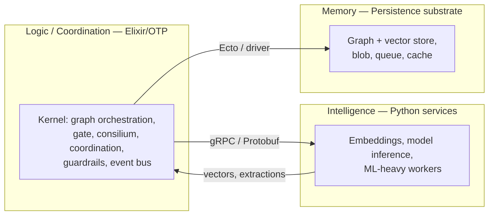
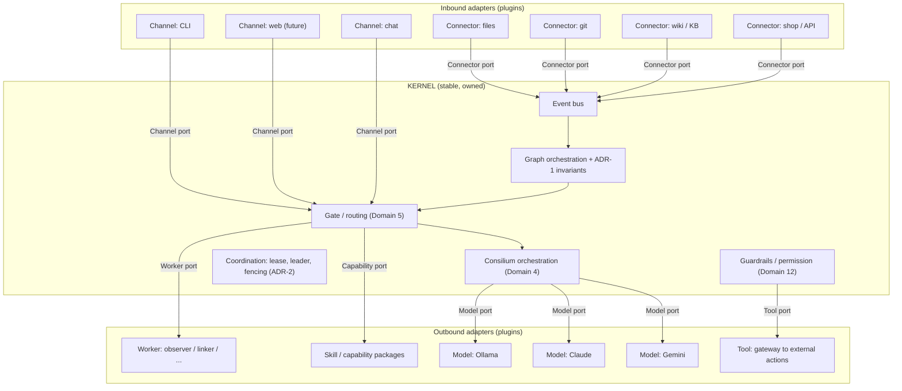
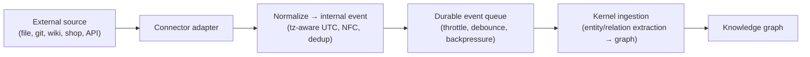
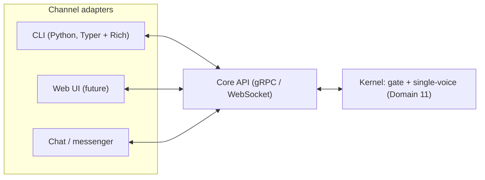
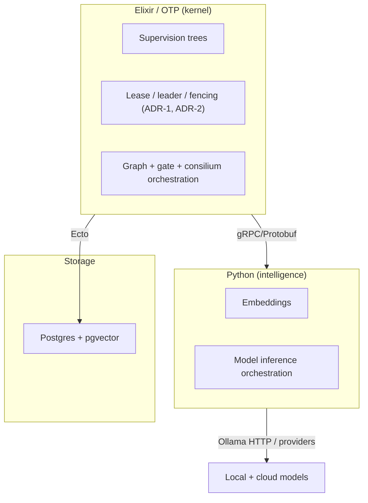
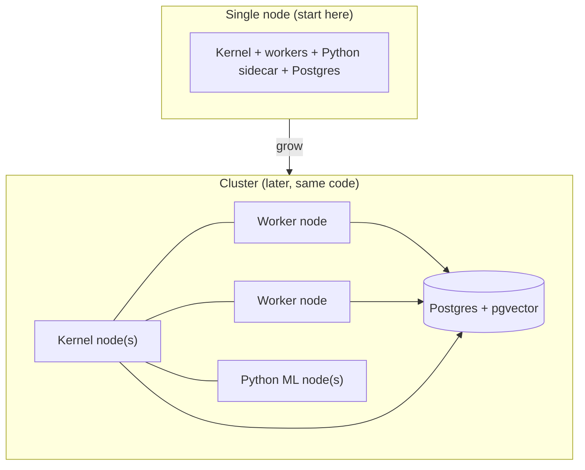

# Heterogeneous Cognitive Swarm — System & Product Architecture

> Companion to [`swarm_architecture_spec.md`](swarm_architecture_spec.md).
> That document specifies **how the swarm thinks** (the cognitive reference
> architecture: 17 domains, ADR-1..9). This document specifies **how the
> software is built, extended, deployed, and operated** — the system shape that
> lets the cognitive architecture survive growth without the maintenance burden
> collapsing under it.

## Abstract

The single biggest long-term risk for a system of this class is not whether the
cognitive model is correct — it is whether the codebase stays maintainable once
it has many data sources, many capabilities, large deployments, and outside
contributors. The architecture below answers that risk with one structural
decision: **a small, stable kernel plus a contract-bound plugin surface**
(microkernel / hexagonal). Everything that grows over time — connectors,
workers, skills, channels, model providers — lives *outside* the kernel as
adapters behind typed ports. The kernel stays small, so the support surface
stays bounded.

Three runtime pillars carry the system:

- **Logic / coordination** — an Elixir/OTP kernel (supervision, leases, leader
  election, distribution).
- **Intelligence** — Python services for ML (embeddings, model inference),
  reached as external services.
- **Memory** — a persistence substrate (graph + vector + blob + queue).

Configuration, wire protocol, and logging are the harness that binds the
pillars, not pillars themselves.

---

## 1. Purpose, goals, non-goals

### Purpose

A persistent, local-first assistant that observes a working context (files,
repositories, wikis, tickets, system state), maintains a shared knowledge graph,
and helps a person or a team — answering, summarizing, flagging, and acting
under guardrails. Cheap specialized processes run continuously; large models are
the rare escalation.

### Goals

- **Local-first.** Runs on one machine; cloud models are an optional escalation.
- **Cost-asymmetric.** Routine work is cheap and constant; expensive models are
  rare and deliberate.
- **Extensible without core changes.** New data sources, capabilities, and
  channels are added as plugins.
- **Operable at scale.** A single-node deployment and a multi-node cluster run
  the same code; failures degrade capability, not availability.
- **Auditable.** Every outward action and every escalation is traceable.

### Non-goals (scope discipline)

Scope sprawl is the usual root cause of an unmaintainable system. Explicit
non-goals:

- **Not AGI / not autonomous self-improvement.** Reward comes from external
  ground truth (ADR-4), not open-ended self-supervision.
- **Not a general chatbot platform.** It is grounded in a knowledge graph, not a
  free-form conversational product.
- **Not a model-training framework.** It *uses* models; it does not train them.
- **Not hard-real-time.** Throughput and correctness over millisecond latency.
- **Not multi-tenant SaaS (initially).** Single-graph, context-scoped topology
  (ADR-5); a hosted multi-tenant offering is out of scope for the core.

---

## 2. The three pillars



- **Logic (Elixir/OTP).** Owns the kernel: the knowledge graph orchestration,
  the gate (Domain 5), consilium orchestration (Domain 4), coordination (ADR-1/ADR-2),
  guardrails (Domain 12), and the internal event bus. OTP gives supervision, leases,
  leader election, and distribution natively — the exact coordination primitives
  that are error-prone to hand-roll.
- **Intelligence (Python).** Owns ML: embedding generation, model inference
  orchestration, and any ML-heavy worker. Reached as an external service over
  gRPC. Python keeps the strongest ML/embedding/graph ecosystem; the kernel does
  not embed model code.
- **Memory (storage substrate).** Owns durable state: the graph + vectors, blob
  storage, queues, cache. See §7.

The split is deliberate: the part that is hard to retrofit (coordination,
concurrency, supervision) lives where it is native (OTP); the part with the
richest libraries (ML) lives where they are (Python); they communicate only
through a typed contract.

---

## 3. Kernel and plugins (microkernel / hexagonal)

The defining decision. The kernel is small and stable; everything that grows is
an adapter behind a port.



### Kernel (stable, owned by the core team)

Knowledge graph orchestration and storage invariants (ADR-1), coordination
(ADR-2), gate (Domain 5), consilium orchestration (Domain 4), confidence calculus (ADR-3),
guardrails and permission model (Domain 12), and the event bus. The kernel changes
rarely and is the only part requiring deep review.

### Ports (typed contracts, Protobuf-defined)

- **Connector port** — bring external data in (normalize → event → graph).
- **Worker port** — small specialized agents act on graph state.
- **Channel port** — talk to a user / front, under the single-voice rule (Domain 11).
- **Model port** — an LLM provider (local or cloud).
- **Capability / Skill port** — a declarative capability the gate can route to.
- **Tool port** — outward actions, funneled through one gateway (Domain 12).

### Adapters (plugins, community-extendable, never touch the kernel)

Concrete connectors, workers, channels, skills, model providers, and tools. A
contributor adds a new IMDB or shop connector by implementing the Connector
port — without reading or modifying kernel code.

### Why this answers the maintenance fear

- A bounded kernel means a bounded review and support surface, regardless of how
  many adapters exist.
- A faulty community adapter fails **in isolation** (its own OTP process;
  graceful degradation) and cannot corrupt the graph — all mutation goes through
  the kernel boundary with validation (ADR-1, ADR-7).
- Capability grows by addition (new adapters), not by editing the core.

---

## 4. Data ingestion (Connector port)

How information enters the system (Domain 2). A connector is an inbound adapter with a
single job: turn an external source into normalized events on the bus.



Connector contract (Protobuf):

```protobuf
service Connector {
  // Stream normalized events from the source into the kernel.
  rpc Stream (StreamRequest) returns (stream Event);
  // Report connector health and capability for the registry.
  rpc Describe (Empty) returns (ConnectorInfo);
}
```

Rules baked into the contract and the kernel boundary:

- **Time is tz-aware at the boundary.** External timestamps localize to the
  source timezone and convert to UTC on entry; naive time is never stamped as
  UTC (Domain 2).
- **Unicode is normalized without loss.** NFC, never a lossy ASCII fold (Domain 2).
- **Events are deduplicated** by a content key; a Bloom filter is the cheap
  first pass before any store hit.
- **Backpressure is explicit.** If ingestion lags consolidation, the queue
  throttles or sheds load by policy — it does not grow unbounded.

Connector code lives in its own package (e.g. `connectors/git`), never in the
kernel. Third parties ship connectors independently.

---

## 5. Capabilities and skills (Capability port)

A **skill** is a declarative capability package the gate can route to and a
worker or the consilium can execute. The format follows the Claude Agent Skills
convention: a `SKILL.md` file with a **YAML frontmatter** (machine-read) and a
**Markdown body** (model-read).

```yaml
---
name: summarize-ticket
description: >
  Use when the user asks for a concise summary of a ticket or change,
  including status, blockers, and last activity.
allowed_tools: [graph.read, ticket.fetch]
cost_tier: cheap
---
```

```text
# Markdown body: the capability's instructions / prompt, authored for the model.
```

Why the hybrid format, not pure YAML or pure MD:

- **Frontmatter (YAML)** is the routing and discovery contract. The gate (Domain 5)
  matches `description` to the incoming need — the same mechanism as semantic
  intent prototypes. It is structured and machine-parsed.
- **Body (Markdown)** is the natural-language instruction set the model
  consumes. Prose belongs in Markdown.
- **Interop.** Matching the established Agent Skills format means tooling and
  community familiarity, and a skill authored elsewhere drops in unchanged.

How skills fit the architecture:

- Skills register as adapters behind the Capability port — capability grows
  without kernel changes.
- Frontmatter feeds the **self-model** (Domain 6: capabilities, available tools) and
  the **gate** (Domain 5: route by capability match).
- **Progressive disclosure aligns with cost-asymmetry.** Only `name` +
  `description` stay resident in context (cheap); the full body loads **only**
  when the gate routes to the skill. This is the cost-asymmetry principle applied
  at the capability level.
- **Security via `allowed_tools`** ties to the permission model (Domain 12).
  Community / untrusted skills run sandboxed; all actions go through the Tool
  gateway; a failing skill is isolated.

Skills (capability packages) and models are separate concerns: a skill is *what*
to do; a model behind the Model port is *which brain* runs it.

---

## 6. Channels and frontends (Channel port)

There is one core API and many thin clients. The single-voice rule (Domain 11) lives
in the kernel; a front is a Channel adapter that renders output and accepts
input — it holds no cognition.



Adding a front means implementing the Channel contract against the core API; the
kernel is untouched. The same kernel serves CLI, web, and chat simultaneously.

### CLI-first for testing (now)

The web front is deferred. The first and cheapest interface is a CLI:

- **For raw kernel poking during development:** Elixir-native `Mix` tasks / IEx —
  zero cross-language cost, in-process.
- **As the first real Channel adapter:** a **Python CLI (Typer + Rich)** over
  gRPC. It is cheap, batteries-included, and pleasant; and it doubles as the
  earliest proof that the cross-language Channel contract works end-to-end.

The CLI is the testing front for the foreseeable future; the web UI slots in
later as another Channel adapter with no kernel change.

---

## 7. Storage, protocol, configuration, logging

These are the harness binding the pillars. Each job gets the right tool; do not
conflate them.

| Job | Choice | Why |
| --- | --- | --- |
| Human configuration | YAML, schema-validated | Declarative, commented, git-versioned (Domain 17); fail-loud on invalid (ADR-7) |
| Wire / port contracts | Protobuf (+ gRPC) | Typed, versionable without breakage, codegen for Elixir and Python; the schema *is* the extension contract |
| Memory: graph + vectors | Native graph (Memgraph / KùzuDB / Neo4j) is a first-class candidate because traversal is the primary access pattern (Domain 1); Postgres + pgvector is the boring-reliable baseline to beat. Decide by spike | ACID transactions and CAS (ADR-1); hybrid graph+vector; traversal performance is a first-class criterion, not an afterthought |
| Blob / files | S3-compatible or filesystem | Behind the storage port |
| Event / task queue | Durable queue (Oban on Postgres, or a broker) | Backpressure, retries, dead-letter |
| Cache | ETS (in-BEAM) / Redis | Hot results, model outputs |
| Membership optimization | Bloom filters | Cheap dedup; lineage pre-filter for ADR-3 (Open Problem) |
| Logs | JSONL | Structured, exportable to Grafana / EFK |

Notes:

- **Configuration.** YAML for human-edited settings (rules, thresholds,
  connector and model registries, scope policies). Validate against a schema on
  load. Secrets live in env / vault, never in YAML. Config is read at
  function scope, not at import time.
- **Protocol.** Protobuf defines every port and the Elixir↔Python boundary;
  schema evolution (field addition) keeps adapters working across versions. JSON
  is for human-facing output and logs only, not contracts.
- **Storage.** The graph engine is the one foundational pick — choose it by a
  short spike against the hard requirements: transactional CAS, hybrid
  graph+vector (ADR-1), **and traversal performance**, since traversal is the
  primary mode of "thinking" (Domain 1), not an incidental query. Everything
  else (blob, queue, cache) is standard and swappable.
- **Storage port is a leaky abstraction — scope it honestly.** The port cleanly
  abstracts CRUD, CAS, and vector search. It does **not** abstract traversal:
  query languages differ too much (SQL recursive CTEs vs Cypher vs Kùzu), so
  traversal queries are engine-specific and must be rewritten on migration.
  Treat the graph-engine choice as effectively load-bearing, not a painless swap
  — which is another reason to weight a native graph in the spike rather than
  defaulting to Postgres.
- **Bloom filters** are an optimization layer (cheap set-membership), not a
  storage substrate: ingestion dedup, a cheap lineage pre-filter for the
  noisy-OR independence check (ADR-3), and fast claim-existence tests.
- **Logging** is JSONL so it exports cleanly into Grafana / EFK pipelines.

---

## 8. Tech stack decision



- **Elixir/OTP for the kernel.** The hardest-to-retrofit layer is coordination
  (ADR-1/ADR-2): leases, fencing, leader election, supervision, graceful
  degradation, and single-node→cluster distribution. OTP provides these as
  primitives (`Registry`, `:global`, `Horde`, `libcluster`), with hot reload and
  `:observer`/telemetry that lower operational cost at scale. This is exactly
  where a hand-rolled approach previously failed.
- **Python for intelligence.** Embeddings and inference live in Python services
  reached over gRPC — the richest ML ecosystem, without embedding model code in
  the kernel. Inference itself is an external service (e.g. Ollama HTTP) or a
  Python worker.
- **Why commit the kernel to Elixir now, not later.** Rewriting the coordination
  spine after the system is live is the worst rewrite. The cognitive architecture
  can be validated with a thin slice, but the coordination invariants belong in
  OTP from the start.

---

## 9. Deployment and scaling

The same code runs on one node and on a cluster; BEAM distribution makes
horizontal scale a configuration concern, not a rewrite.



What scales horizontally vs what is a singleton:

- **Horizontal (many).** Swarm workers (observer, linker, classifier, …), Python
  ML services, channel adapters. Workers spread across nodes via OTP
  distribution; failures are isolated and supervised.
- **Singleton (exactly one).** Consolidation / "sleep", global graph rebuild,
  embedding re-migration — run under leader election with a fenced lease and a
  liveness alarm (ADR-2). These are the operations that must not double-run.
- **Storage.** Starts as one Postgres instance; scales with standard
  read-replica / partitioning strategies behind the storage port.

Operational guarantees come from the kernel principles: graceful degradation (a
down component lowers capability, not availability), audit logging of every
outward action, and a kill switch (Domain 12, Domain 13).

---

## 10. Extension model

How the system grows over years without the core team becoming a bottleneck.

| Extension | Port | Where it lives | Reviewed by |
| --- | --- | --- | --- |
| New data source | Connector | `connectors/<name>` package | Adapter review only |
| New small agent | Worker | `workers/<name>` package | Adapter review only |
| New capability | Capability / Skill | `SKILL.md` package | Adapter + permission review |
| New front | Channel | `channels/<name>` package | Adapter review only |
| New model provider | Model | `models/<name>` package | Adapter review only |
| New outward action | Tool | behind the Tool gateway | Security review (Domain 12) |

A contributor never edits the kernel to add capability. The kernel team owns the
ports and the invariants; the community owns the adapters. This is the structural
answer to the support-cost question: the part that requires expensive review
stays small and fixed.

---

## 11. Relationship to the cognitive spec

This document and [`swarm_architecture_spec.md`](swarm_architecture_spec.md) are
two views of one system:

- The **cognitive spec** defines *what the swarm computes* — domains, the
  confidence calculus, learning, the gate, and the locked decisions (ADR-1..9).
- This **system architecture** defines *how that computation is packaged* — the
  kernel/plugin boundary, the pillars, ingestion, skills, storage, deployment,
  and extension.

The cognitive ADRs constrain this document: ADR-1 (concurrency) and ADR-2
(coordination) are why the kernel is Elixir/OTP; ADR-3 (confidence) and ADR-6
(embedding stamps) shape storage; ADR-5 (visibility scope) shapes graph schema
and the gate; Domain 2 shapes the Connector port; Domain 11 shapes the Channel port; Domain 12
shapes the Tool port and permission model.

---

## 12. First vertical slice (build order)

To validate the architecture, build the thinnest end-to-end path before adding
breadth:

1. **Storage spike.** Pick the graph engine by testing transactional CAS plus
   hybrid graph+vector (ADR-1). This is the one foundational decision.
2. **Kernel skeleton (Elixir).** Event bus + graph orchestration with ADR-1
   invariants baked in: transactions, fencing tokens, provenance tags, the
   `visibility-scope` and `reliability` columns from day one (these are the
   hard-to-retrofit parts).
3. **One connector** (files or git) behind the Connector port.
4. **Two workers** (observer, linker) behind the Worker port, supervised.
5. **Python ML sidecar** for embeddings over gRPC — proves the cross-language
   contract.
6. **CLI channel** (Python, Typer + Rich) over the core API — the testing front.

Everything else (gate, consilium, skills, learning, web front) builds on this
proven foundation, phased in per the cognitive spec.
