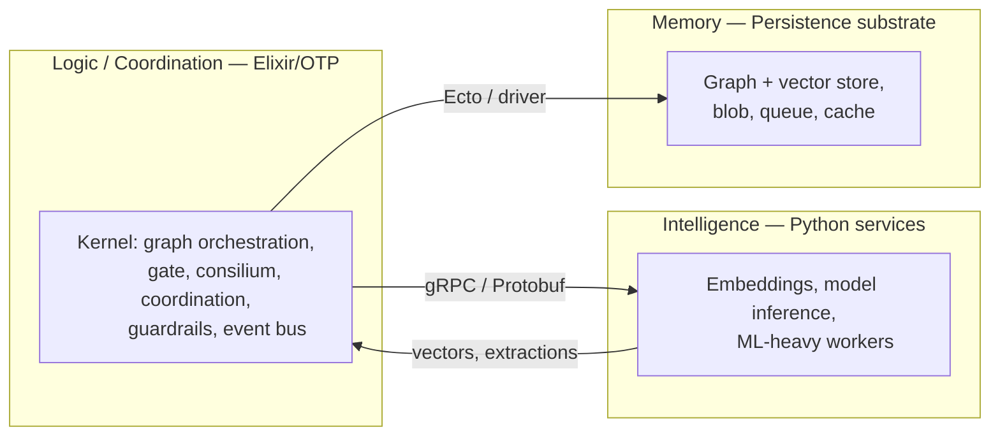
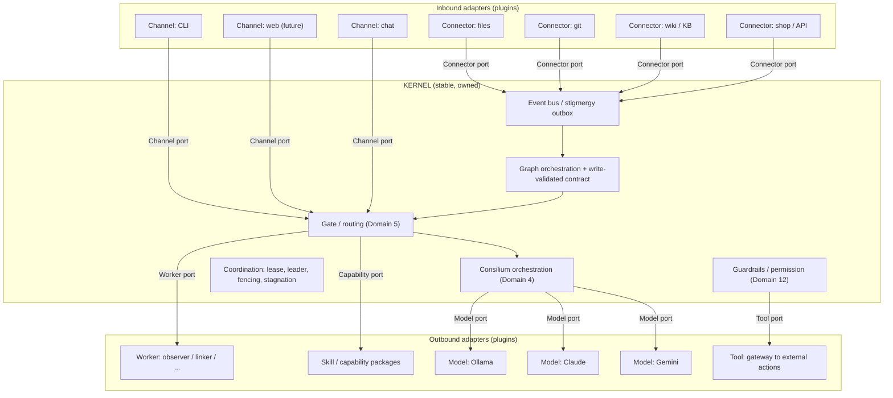
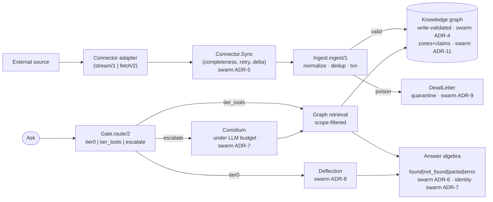
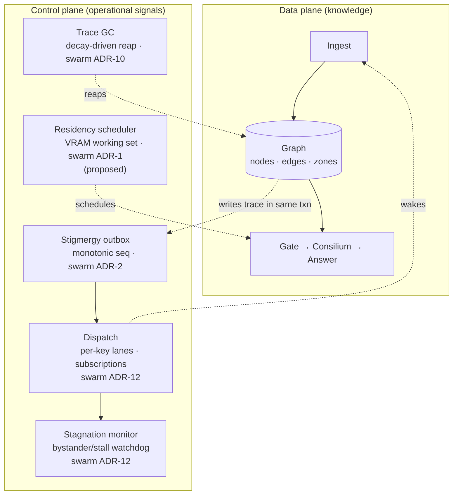
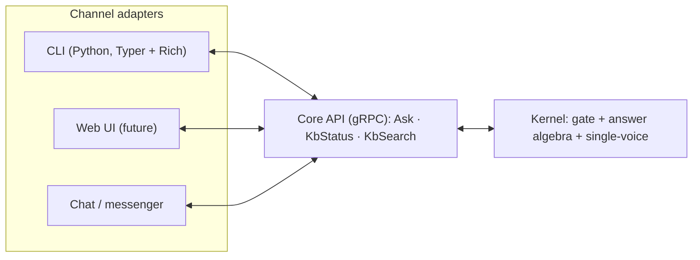
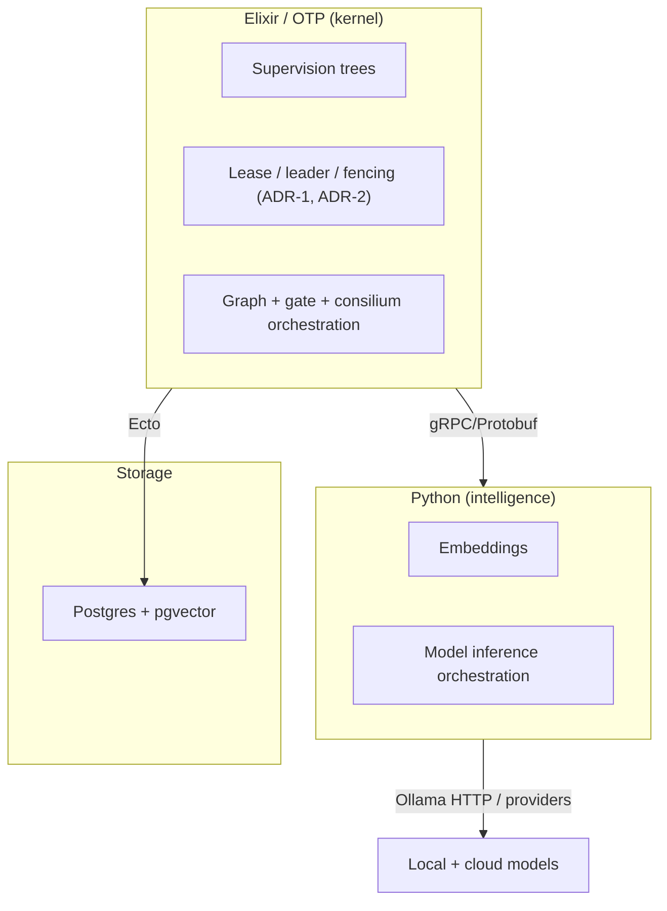
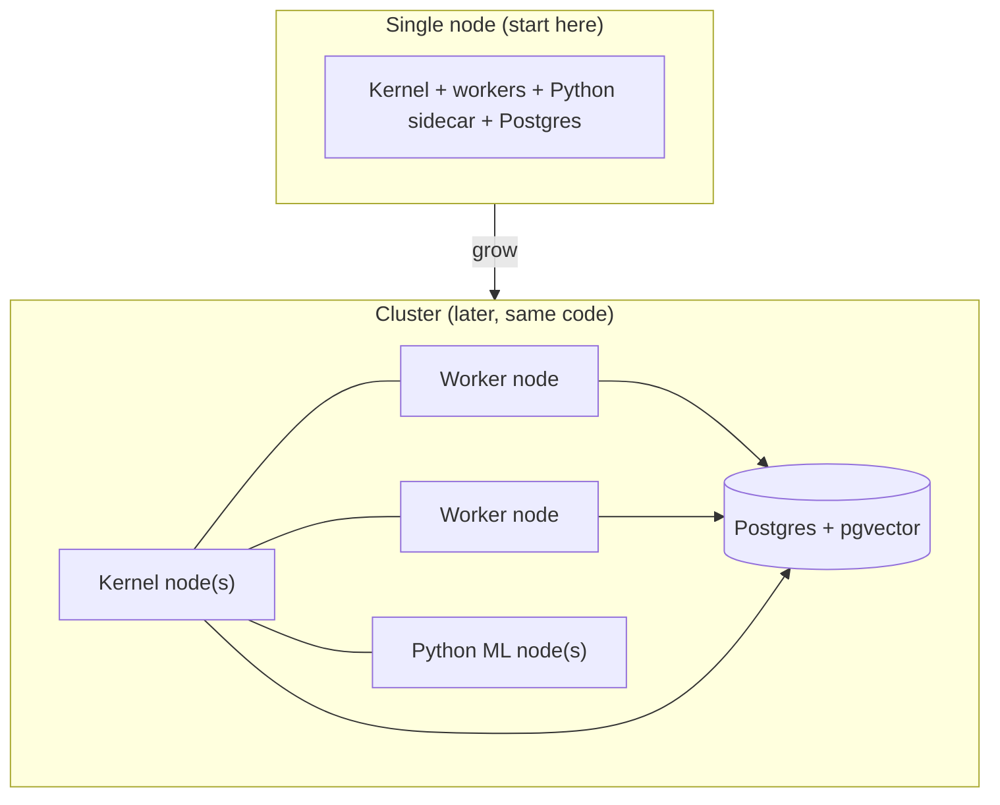
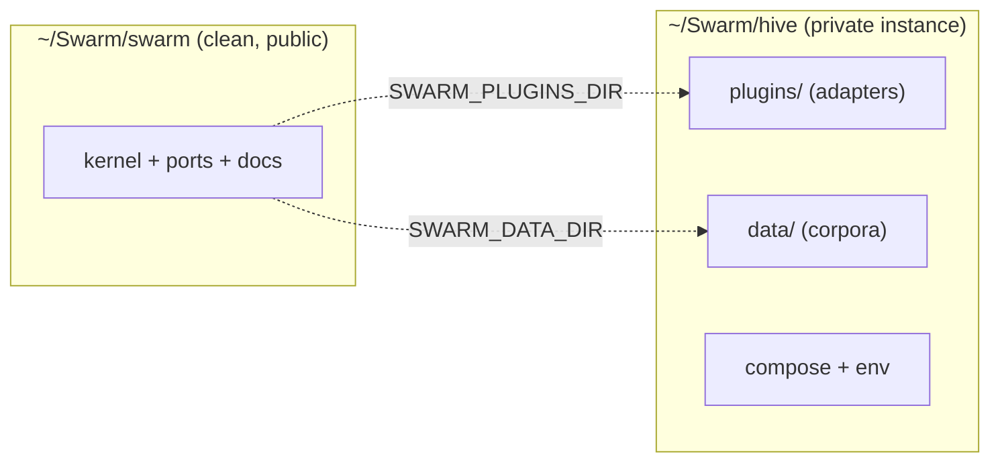

# Heterogeneous Cognitive Swarm — System & Product Architecture

> Companion to [`swarm_architecture_spec.md`](swarm_architecture_spec.md).
> That document specifies **how the swarm thinks** (the cognitive reference
> architecture: 17 domains and the cognitive decisions). This document specifies
> **how the software is built, runs, is extended, deployed, and operated** — the
> system shape that lets the cognitive architecture survive growth, and a faithful
> map of the kernel **as it actually exists today**.
>
> **Two decision namespaces — do not conflate them.** A bare **ADR-n** is a
> *cognitive-spec* decision in the workspace `docs/decisions/` (ADR-0 storage,
> ADR-1 concurrency, ADR-2 coordination, ADR-3 confidence calculus, ADR-4 reward,
> ADR-5 topology/visibility, ADR-6 embeddings, ADR-7 LLM I/O, ADR-8 gate
> thresholds, ADR-9 stigmergic-loop stability). A **swarm ADR-n** is a
> *kernel/runtime* decision in `swarm/docs/decisions/` (swarm ADR-1 residency,
> swarm ADR-2 stigmergy, swarm ADR-3 traversal bounding, swarm ADR-4 graph
> integrity, swarm ADR-5 connector, swarm ADR-6 answer algebra, swarm ADR-7
> self-model/identity, swarm ADR-8 chat/deflection, swarm ADR-9 backpressure/DLQ,
> swarm ADR-10 trace GC, swarm ADR-11 zones/claim-typing, swarm ADR-12
> coordination control). The cognitive ADRs say *what to compute*; the swarm ADRs
> say *how the kernel is built*. Every load-bearing claim below cites one or the
> other explicitly.

## Abstract

The single biggest long-term risk for a system of this class is not whether the
cognitive model is correct — it is whether the codebase stays maintainable once
it has many data sources, many capabilities, large deployments, and outside
contributors. The architecture answers that risk with one structural decision:
**a small, stable kernel plus a contract-bound plugin surface** (microkernel /
hexagonal). Everything that grows over time — connectors, workers, skills,
channels, model providers — lives *outside* the kernel as adapters behind typed
ports. The kernel stays small, so the support surface stays bounded.

What has actually been built is the kernel and its contracts, not the breadth.
Twelve swarm ADRs are locked and (with two exceptions) implemented: a
write-validated graph schema, a kernel-driven connector contract, an answer
algebra, a self-model, off-topic deflection, an LLM budget, poison/DLQ
quarantine, decay-driven garbage collection, graph zones with claim typing, and a
coordination/stagnation monitor. **Every one of these is verified against
hostile mocks and spikes; none has yet parsed a real corpus end to end.** That
honesty is load-bearing and is stated plainly in §12 — the kernel today is a
*fortress of contracts*, not yet a cognitive system proven on live data.

Three runtime pillars carry the system:

- **Logic / coordination** — an Elixir/OTP kernel (supervision, leases, leader
  election, distribution).
- **Intelligence** — Python services for ML (embeddings, model inference),
  reached as external services.
- **Memory** — a persistence substrate (graph + vector + blob + queue), today
  Postgres + pgvector.

Configuration, wire protocol, and logging are the harness that binds the
pillars, not pillars themselves.

---

## 1. Purpose, goals, non-goals

### Purpose

A persistent, local-first assistant that observes a working context (files,
repositories, wikis, tickets, system state), maintains a shared knowledge graph,
and helps a person or a team — answering, summarizing, flagging, and acting
under guardrails. Cheap specialized processes run continuously; large models are
the rare escalation.

### Goals

- **Local-first.** Runs on one machine; cloud models are an optional escalation.
- **Cost-asymmetric.** Routine work is cheap and constant; expensive models are
  rare and deliberate.
- **Extensible without core changes.** New data sources, capabilities, and
  channels are added as plugins.
- **Operable at scale.** A single-node deployment and a multi-node cluster run
  the same code; failures degrade capability, not availability.
- **Auditable.** Every outward action and every escalation is traceable.

### Non-goals (scope discipline)

Scope sprawl is the usual root cause of an unmaintainable system. Explicit
non-goals:

- **Not AGI / not autonomous self-improvement.** Reward comes from external
  ground truth (ADR-4), not open-ended self-supervision.
- **Not a general chatbot platform.** It is grounded in a knowledge graph, not a
  free-form conversational product.
- **Not a model-training framework.** It *uses* models; it does not train them.
- **Not hard-real-time.** Throughput and correctness over millisecond latency.
- **Not multi-tenant SaaS (initially).** Single-graph, context-scoped topology
  (ADR-5); a hosted multi-tenant offering is out of scope for the core.

---

## 2. The three pillars



- **Logic (Elixir/OTP).** Owns the kernel: the knowledge graph orchestration,
  the gate (Domain 5), consilium orchestration (Domain 4), coordination (ADR-1/
  ADR-2), guardrails (Domain 12), and the internal event bus. OTP gives
  supervision, leases, leader election, and distribution natively — the exact
  coordination primitives that are error-prone to hand-roll.
- **Intelligence (Python).** Owns ML: embedding generation, model inference
  orchestration, and any ML-heavy worker. Reached as an external service over
  gRPC. Python keeps the strongest ML/embedding/graph ecosystem; the kernel does
  not embed model code.
- **Memory (storage substrate).** Owns durable state: the graph + vectors, blob
  storage, queues, cache. See §8.

The split is deliberate: the part that is hard to retrofit (coordination,
concurrency, supervision) lives where it is native (OTP); the part with the
richest libraries (ML) lives where they are (Python); they communicate only
through a typed contract.

---

## 3. Kernel and plugins (microkernel / hexagonal)

The defining decision. The kernel is small and stable; everything that grows is
an adapter behind a port.



### Kernel (stable, owned by the core team)

Knowledge-graph orchestration and a **write-validated schema contract** (swarm
ADR-4), coordination (ADR-2; swarm ADR-2/ADR-12), the gate (Domain 5), consilium
orchestration (Domain 4), the confidence calculus (ADR-3; swarm ADR-3/ADR-11),
guardrails and the permission model (Domain 12), and the event bus. The kernel
changes rarely and is the only part requiring deep review. The rest of this
document walks what the kernel actually contains today.

### Ports (typed contracts, Protobuf-defined)

- **Connector port** — bring external data in (normalize → event → graph).
  Realized as `Swarm.Ports.Connector` with two shapes, `stream/1` and `fetch/2`
  (swarm ADR-5; §4.1).
- **Worker port** — small specialized agents react to graph state
  (`Swarm.Ports.Worker`; §5).
- **Channel port** — talk to a user / front under the single-voice rule (Domain
  11); renders the answer algebra (swarm ADR-6) and carries the asker identity
  (swarm ADR-7; §7).
- **Model port** — an LLM provider (local or cloud), used by the consilium under
  a budget (swarm ADR-7 LLM budget / ADR-7; §4.4).
- **Capability / Skill port** — a declarative capability the gate can route to,
  and the seam for persona/rendering (`Swarm.Ports.Skill`; swarm ADR-8; §6).
- **Tool port** — outward actions, funneled through one gateway (Domain 12).

### Adapters (plugins, community-extendable, never touch the kernel)

Concrete connectors, workers, channels, skills, model providers, and tools. A
contributor adds a new wiki or shop connector by implementing the Connector port
— without reading or modifying kernel code.

### Why this answers the maintenance fear

- A bounded kernel means a bounded review and support surface, regardless of how
  many adapters exist.
- A faulty community adapter fails **in isolation** (its own OTP process;
  graceful degradation) and cannot corrupt the graph — all mutation goes through
  the kernel boundary with validation (swarm ADR-4), and un-processable events
  are quarantined, never silently dropped (swarm ADR-9; §4.1).
- Capability grows by addition (new adapters), not by editing the core.

---

## 4. The data path, as built

The spine of the system is a single path: **ingest → graph → gate → (consilium)
→ answer.** Each stage is now a written, write-validated contract with a kernel
module behind it. This section walks the path top-down; §5 then describes the
control plane that runs *around* it.



### 4.1 Ingestion and the connector contract (swarm ADR-5, swarm ADR-9)

A connector is an inbound adapter with a single job: turn an external source into
normalized events for the kernel. The contract (`Swarm.Ports.Connector`) has two
shapes:

- **`stream/1`** — full dump: the connector yields every event lazily for small,
  ceiling-free, local sources.
- **`fetch/2`** — kernel-driven paginated pull: `fetch(cursor, opts)` returns
  `{:ok, %{events: [...], cursor: next | :done, truncated?: bool}}`. The kernel
  drives the cursor to `:done`; the source is never trusted to report its own
  completeness.

`Swarm.Connector.Sync.run/2` owns the loop and **owns completeness**: it drives
the cursor to exhaustion, retries transient fetch failures, logs source ceilings
(`truncated?`) instead of silently capping, tracks the delta watermark, reconciles
delivered-vs-declared totals, and returns a structured report
(`%{mode, ingested, duplicates, errors, pages, ceilings, complete?, watermark}`)
— never raw payloads, so a model only ever reads graph state. Demand-driven pull
(one page at a time) is itself the backpressure on the connector→graph flow, and
bounds memory by page size rather than by source size (swarm ADR-9).

The contract bakes in the cognitive Domain-2 rules at the boundary:

- **Time is tz-aware at the boundary.** External timestamps convert to UTC on
  entry; naive time is never stamped as UTC.
- **Unicode is normalized without loss** (NFC, never a lossy ASCII fold).
- **Provenance is the evidential origin** — the stable identity of the source
  item (e.g. a page id), not the fetch instance — so re-fetching the same item
  does not look like independent corroboration.
- **Events are deduplicated** by a content/provenance key before any store hit.

`Swarm.Ingest.ingest/1` normalizes the event, runs the cheap dedup pre-filter,
and writes the whole event (all entities and relations) in **one transaction**:
each entity upserts a node, each relation an edge keyed by provenance. A contract
violation aborts the transaction and quarantines the event to the `dead_letter`
zone with a reason (`Swarm.Ingest.DeadLetter`, swarm ADR-9) — **poison is
durable, inspectable, and terminal; one malformed event never stalls the
pipeline and never crashes the kernel.**

### 4.2 The graph as a written contract (swarm ADR-4, swarm ADR-11, ADR-3)

The shared graph is the semantic substrate — and its schema is a public kernel
contract, validated at *every* write through `Swarm.Graph.Contract` at the
`Swarm.Graph.Store` boundary (swarm ADR-4):

- **Type** is a non-empty lowercase identifier.
- **Scope** is a closed vocabulary, deny-ordered: `private < group < public`.
  The **visibility invariant** holds at write time:
  `rank(edge) ≤ min(rank(src), rank(dst))` — *an edge is never more visible than
  the narrowest of its two endpoints*. This moved out of ingest into the kernel,
  closing the public-edge-between-private-nodes leak. Defense-in-depth: a DB CHECK
  on the scope vocabulary plus a `FOR SHARE` lock on the endpoint read.
- **Reliability** is a float in `[0, 1]`; **provenance** has a fixed shape.
- The **schema version** is stamped in a singleton `graph_schema_meta` row;
  migrations are round-trip tested.

Each node also carries a **kind** — its trace class — under swarm ADR-11 (the N3
defense against error-cascade): `observation` (external evidence), `claim`
(LLM-generated), `hypothesis`, `coordination`, `lease`, `derived`, `presentation`,
`durable_fact`. This typing is the defense against a hallucination
inflating confidence by repetition: `Swarm.Graph.Confidence.combine_typed/1` collapses *all*
LLM-generated kinds into a single group (max within the group), while each
external kind is its own independent group combined noisy-OR. So three generated
contributions of 0.8 yield 0.8, while two independent observations of 0.8 yield
0.96. **Now LIVE (workspace ADR-13 / EOS-2, 2026-06-25):** `combine_typed/1` was dead code until
the evidential-origin epic wired it into the read path via node-local `Swarm.Graph.Corroboration`
(origin-dedup before the combine), paired with the strength-side per-origin reinforcement ceiling
(`seen_count = count(distinct origin)`) — so N derivatives of one origin no longer over-corroborate
in either dimension. Persistence is **reward-gated**: a refuted trace (`reward < 0`) is excluded
from traversal immediately and reaped by GC; `reward ≥ 0` persists on the decay
schedule. Adding `node.kind` and `edge.reward` **bumped the schema v1→v2** — the
first real exercise of swarm ADR-4's migration round-trip policy.

Confidence over the graph is computed by traversal, and traversal is bounded.
The cognitive confidence calculus is ADR-3; swarm ADR-3 records *where it
collapses on a dense graph* — the T1 saturation spike showed the cost is **path
enumeration** in the recursive-CTE traversal, not the independence-grouping open
problem (grouping is ~O(P), sub-second even at 299k groups). The decided fix is
node-bounded best-confidence-per-node relaxation plus a best-effort-above-budget
result flagged as truncated; the relaxation rewrite is the one deferred
implementation (follow-up `traverse-relaxation`), with the `max_depth` cap
enforced meanwhile.

### 4.3 The gate and deflection (Domain 5, swarm ADR-8, ADR-8)

`Swarm.Gate.route/2` decides how much a question costs *before* spending anything.
It scores the message by embedding similarity to intent prototypes (bge-m3),
falling back to a conservative keyword floor if the embedder is down, and routes
to one of three tiers:

- **tier0** — canned, **zero-LLM**: greetings, farewells, and recognized
  off-topic. Off-topic that matches the `:off_topic` prototype is deflected on the
  zero-LLM path and **does not escalate** (swarm ADR-8). This is the first line of
  the cost-asymmetry guarantee.
- **tier_tools** — deterministic graph retrieval, scope-filtered (default
  `["public"]`; an identity-scoped "my X" query narrows to the viewer's items).
  One indexed query, bounded by `:limit`.
- **escalate** — hand off to the consilium.

The split threshold (≈0.677 handle/escalate) is empirically derived (ADR-8). The
known risk, called out for the live slice, is that *novel* off-mission input that
does not match the off-topic prototype falls through to the escalate-under-doubt
floor — real ambiguity can therefore drive escalation rate, which is exactly what
§12 says is unproven and what the first live corpus must measure.

### 4.4 Escalation: consilium under a budget (Domain 4, swarm ADR-7 LLM budget, ADR-7)

When the gate escalates, `Swarm.Consilium.deliberate/2` runs a parallel panel of
local models, then a different-family judge, and returns a verdict with a measured
`disagreement` across the panel — divergence is surfaced, not averaged away. Every
model call is governed by the **LLM budget** (the cognitive ADR-7 LLM-I/O
decision, realized as the swarm ADR-7 budget): a per-escalation token ceiling plus
a model-boundary backstop and cost telemetry. Exceeding the ceiling is **refused
fail-loud** — there is no silent truncation, and pathological long-context paths
are refused rather than quietly run. Which models are resident when contention is
high is the job of the residency scheduler (swarm ADR-1; §5), still on paper.

### 4.5 The answer contract: result algebra, self-model, identity (swarm ADR-6, swarm ADR-7)

`Swarm.Core.ask/2` always returns a typed answer with an explicit
`status: :found | :not_found | :partial | :error` (swarm ADR-6). The four are
structurally distinct: an empty graph result is `:not_found`, **not** a
low-confidence answer; a transport failure (`Postgrex.Error`,
`DBConnection.ConnectionError`) is caught and mapped to `:error` with the raw
string logged for the operator only, never shown to the user; a programmer bug is
*not* swallowed (it crashes loud). The status crosses the wire as an
`AnswerStatus` enum in `core.proto`, so channels render from a structured field,
never by parsing prose (the presentation-determinism standard; §7).

The kernel also knows itself. `Core.status` reports a real self-model (swarm
ADR-7): graph size, per-type inventory, freshness (last write activity),
embedding stamps, and live capabilities (attached connectors + the consilium
panel). The `AskRequest` carries a `viewer` — the asker's opaque canonical id —
so a possessive query ("my X") narrows to the viewer's items *within allowed
scopes* (a viewer never grants scope), and a possessive query with no viewer
returns an `identity_required` signal rather than guessing. The id→identity
mapping lives in the channel/hive config, never in the kernel.

---

## 5. The control plane (the honest shape)

The graph is the semantic substrate, and coordination is meant to be stigmergic —
agents reacting to traces, not messaging each other. But the kernel **also runs a
real control plane**: operational signals *around* the graph that are not
themselves knowledge. Calling this "messages-free stigmergy" would overclaim; the
honest description is a stigmergic data plane with a small, explicit control plane
beside it.



- **Stigmergy signal (swarm ADR-2, Accepted).** A graph mutation writes a trace
  to a transactional **outbox** (monotonic sequence, change kind, target key,
  payload) in the *same* transaction. A single supervised in-process tailer
  consumes past a persisted cursor, partitioned by key for ordered parallelism;
  `LISTEN/NOTIFY` is a wake-hint only. "Nothing was dropped" is provable from the
  monotonic sequence + gap detection — the outbox + cursor is the source of truth,
  never the notification.
- **Coordination control (swarm ADR-12, Accepted).** Workers subscribe to the
  change kinds they handle (`Swarm.Stigmergy.Dispatch.subscribe/3`); the tailer
  routes each row to its per-target-key lane and invokes only interested handlers
  — no full-graph polling. The **stagnation monitor**
  (`Swarm.Coordination.Stagnation`) closes the bystander deadlock: an unmatched
  change (no subscriber) is surfaced once and deduped, and a stalled claim (a
  coordination trace unclaimed past its TTL) is found by a config-gated watchdog.
- **Trace lifecycle / GC (swarm ADR-10, Accepted).** `Swarm.Graph.GC.reap/1`
  deletes edges whose `saturation(seen_count) · exp(-ρ·age_days)` falls below a
  floor. The decay rate ρ is **re-derivable** from a target half-life
  (`ρ = ln(2)/H`), not a magic constant; Hill saturation bounds strength below 1.
  A bench shows ≈10× working-set reduction with GC enabled. This is what keeps the
  working set bounded under churn instead of growing forever.
- **Model residency scheduler (swarm ADR-1, Proposed — not yet built).** A
  kernel-owned broker treating VRAM as a scarce resource: cost-aware working-set
  scheduling, priority preemption, and laziness (force only as many consilium
  members as needed), exposed as `with_model(ref, fun)`. The residency spike
  measured real hardware; the scheduler itself is the second deferred item.

The data plane and the control plane meet at exactly one place: a graph write and
its outbox trace share a transaction. Everything else in the control plane is a
supervised, config-gated background process — which is why the kernel can be honest
that it is *operationally coordinated*, not purely emergent.

---

## 6. Capabilities and skills (Capability / Skill port)

A **skill** is a declarative capability package the gate can route to and a worker
or the consilium can execute. The format follows the Claude Agent Skills
convention: a `SKILL.md` with **YAML frontmatter** (machine-read) and a
**Markdown body** (model-read).

```yaml
---
name: summarize-ticket
description: >
  Use when the user asks for a concise summary of a ticket or change,
  including status, blockers, and last activity.
allowed_tools: [graph.read, ticket.fetch]
cost_tier: cheap
---
```

```text
# Markdown body: the capability's instructions / prompt, authored for the model.
```

Why the hybrid format, not pure YAML or pure MD:

- **Frontmatter (YAML)** is the routing and discovery contract. The gate (Domain
  5) matches `description` to the incoming need — the same mechanism as semantic
  intent prototypes. It is structured and machine-parsed.
- **Body (Markdown)** is the natural-language instruction set the model consumes.
- **Interop.** Matching the established Agent Skills format means tooling and
  community familiarity; a skill authored elsewhere drops in unchanged.

How skills fit the architecture:

- Skills register as adapters behind the Capability port — capability grows
  without kernel changes.
- Frontmatter feeds the **self-model** (Domain 6, swarm ADR-7) and the **gate**
  (Domain 5).
- **Progressive disclosure aligns with cost-asymmetry.** Only `name` +
  `description` stay resident (cheap); the full body loads **only** when the gate
  routes to the skill.
- **Security via `allowed_tools`** ties to the permission model (Domain 12).
  Community / untrusted skills run sandboxed; all actions go through the Tool
  gateway; a failing skill is isolated.

The Skill port (`Swarm.Ports.Skill`) is also the seam where **persona and
rendering** live (swarm ADR-8): `render/2` phrases an answer for its context and
`deflection/1` supplies rotating off-topic copy. Persona is never kernel code —
the kernel returns a neutral steer-back and the structured answer; the hive
deployment owns voice, register, and language. Skills (capability packages) and
models are separate concerns: a skill is *what* to do; a model behind the Model
port is *which brain* runs it.

---

## 7. Channels and frontends (Channel port)

There is one core API and many thin clients. The single-voice rule (Domain 11)
lives in the kernel; a front is a Channel adapter that renders output and accepts
input — it holds no cognition.



**Presentation is deterministic.** The kernel emits facts — the answer algebra's
typed `status`, confidence, citations, and verbatim values; the channel renders
them. The CLI renders status from the structured `AnswerStatus` field and shows
verbatim values, never re-parsing or re-deciding from prose. Adding a front means
implementing the Channel contract against the core API; the kernel is untouched,
and the same kernel serves CLI, web, and chat simultaneously.

### CLI-first for testing (now)

The web front is deferred. The first and cheapest interface is a CLI:

- **For raw kernel poking during development:** Elixir-native `Mix` tasks / IEx —
  zero cross-language cost, in-process.
- **As the first real Channel adapter:** a **Python CLI (Typer + Rich)** over the
  gRPC core API. It is cheap, batteries-included, pleasant, and doubles as the
  earliest proof that the cross-language Channel contract works end-to-end.

The chat channel and its persona copy are deferred to the hive
(`board/todo/hive-chat-channel`); the web UI slots in later as another Channel
adapter with no kernel change.

---

## 8. Storage, protocol, configuration, logging

These are the harness binding the pillars. Each job gets the right tool; do not
conflate them.

| Job | Choice | Why |
| --- | --- | --- |
| Human configuration | YAML, schema-validated | Declarative, commented, git-versioned (Domain 17); fail-loud on invalid (ADR-7) |
| Wire / port contracts | Protobuf (+ gRPC) | Typed, versionable without breakage, codegen for Elixir and Python; the schema *is* the extension contract |
| Memory: graph + vectors | **Postgres + pgvector today** (the boring-reliable baseline); a native graph (Memgraph / KùzuDB / Neo4j) stays a candidate if a traversal re-test reopens it | ACID transactions and CAS (ADR-1); hybrid graph+vector; the write-validated schema contract (swarm ADR-4) lives here |
| Blob / files | S3-compatible or filesystem | Behind the storage port |
| Event / task queue | Transactional outbox in Postgres (swarm ADR-2) | Backpressure, retries, dead-letter, provable no-drop |
| Cache | ETS (in-BEAM) / Redis | Hot results, model outputs |
| Membership optimization | Bloom filters | Cheap dedup; lineage pre-filter for ADR-3 (open problem) |
| Logs | JSONL | Structured, exportable to Grafana / EFK |

Notes:

- **Configuration.** YAML for human-edited settings (rules, thresholds, connector
  and model registries, scope policies). Validate against a schema on load.
  Secrets live in env / vault, never in YAML. Config is read at function scope,
  not at import time.
- **Protocol.** Protobuf defines every port and the Elixir↔Python boundary;
  schema evolution (field addition) keeps adapters working across versions. The
  answer algebra (swarm ADR-6) and the self-model/identity fields (swarm ADR-7)
  are carried in `core.proto`.
- **Storage, honestly scoped.** The storage port cleanly abstracts CRUD, CAS, and
  vector search. It does **not** abstract traversal: query languages differ too
  much (SQL recursive CTEs vs Cypher vs Kùzu), so traversal queries are
  engine-specific and must be rewritten on migration. The graph-engine choice is
  effectively load-bearing, not a painless swap — and the **single
  schema-validated Postgres write path is a known throughput question** the live
  slice must stress (§12).
- **Schema is versioned.** A singleton `graph_schema_meta` row stamps the schema
  version (now v2); migrations round-trip test the upgrade and the
  default-on-read of new columns.
- **Logging** is JSONL so it exports cleanly into Grafana / EFK pipelines.

---

## 9. Tech stack decision



- **Elixir/OTP for the kernel.** The hardest-to-retrofit layer is coordination
  (ADR-1/ADR-2): leases, fencing, leader election, supervision, graceful
  degradation, and single-node→cluster distribution. OTP provides these as
  primitives (`Registry`, `:global`, `Horde`, `libcluster`), with hot reload and
  `:observer`/telemetry that lower operational cost at scale.
- **Python for intelligence.** Embeddings and inference live in Python services
  reached over gRPC — the richest ML ecosystem, without embedding model code in
  the kernel. Inference itself is an external service (e.g. Ollama HTTP) or a
  Python worker.
- **Why commit the kernel to Elixir now, not later.** Rewriting the coordination
  spine after the system is live is the worst rewrite. The cognitive architecture
  can be validated with a thin slice, but the coordination invariants belong in
  OTP from the start.

---

## 10. Deployment and scaling

The same code runs on one node and on a cluster; BEAM distribution makes
horizontal scale a configuration concern, not a rewrite.



What scales horizontally vs what is a singleton:

- **Horizontal (many).** Swarm workers (observer, linker, classifier, …), Python
  ML services, channel adapters. Workers spread across nodes via OTP distribution;
  failures are isolated and supervised.
- **Singleton (exactly one).** Consolidation / "sleep", global graph rebuild,
  embedding re-migration, the stigmergy tailer, and the GC/stagnation/residency
  background processes — run under leader election with a fenced lease and a
  liveness alarm (ADR-2; swarm ADR-2). These must not double-run.
- **Storage.** Starts as one Postgres instance; scales with standard read-replica
  / partitioning strategies behind the storage port.

The production stack is fully containerized and runs from the hive compose
(kernel + ML×N + Ollama-on-GPU + Postgres), with a proven offline boot; see
`docs/design/dockerization-design.md` and `../../hive/docs/operations.md`.
Operational guarantees come from the kernel principles: graceful degradation, an
audit log of every outward action, and a kill switch (Domain 12, Domain 13).

---

## 11. Extension model

How the system grows over years without the core team becoming a bottleneck.

| Extension | Port | Where it lives | Reviewed by |
| --- | --- | --- | --- |
| New data source | Connector | `connectors/<name>` package | Adapter review only |
| New small agent | Worker | `workers/<name>` package | Adapter review only |
| New capability | Capability / Skill | `SKILL.md` package | Adapter + permission review |
| New front | Channel | `channels/<name>` package | Adapter review only |
| New model provider | Model | `models/<name>` package | Adapter review only |
| New outward action | Tool | behind the Tool gateway | Security review (Domain 12) |

A contributor never edits the kernel to add capability. The kernel team owns the
ports and the invariants; the community owns the adapters. This is the structural
answer to the support-cost question: the part that requires expensive review
stays small and fixed.

---

## 12. What is contract-and-mechanism vs. proven-on-real-data

This is the most important section to read honestly. **Everything described above
is built and verified against hostile mocks, fixtures, and spikes — and none of it
has yet run end-to-end on a real corpus.** The kernel today is a fortress of
contracts that has never parsed a real paragraph. The contracts are proven against
*the problem they solve* (a hostile paginating source, a schema-drifted write, a
coherence cascade, a saturated traversal), not against a live multi-source corpus
at scale.

| Subsystem | Decision | State |
| --- | --- | --- |
| Graph integrity contract | swarm ADR-4 | Built, validated against mocks |
| Connector contract (`fetch/2` + Sync) | swarm ADR-5 | Built, hostile-fixture proof |
| Answer-result algebra | swarm ADR-6 | Built, validated |
| Self-model + identity | swarm ADR-7 | Built, validated |
| Off-topic deflection + Skill port | swarm ADR-8 | Kernel built; chat/persona deferred to hive |
| LLM budget | cognitive ADR-7 (LLM I/O), realized in kernel | Built, validated |
| Backpressure + poison/DLQ | swarm ADR-9 | Built, validated |
| Trace GC (decay) | swarm ADR-10 | Built; bench ≈10× working-set reduction |
| Stigmergy signal | swarm ADR-2 | Built, validated |
| Zones + claim typing (N3) | swarm ADR-11 | Built; schema v1→v2 round-trip |
| Coordination / stagnation | swarm ADR-12 | Built, validated |
| Confidence traversal bounding | swarm ADR-3 | **Decided, not yet implemented** (CTE cap meanwhile) |
| Model residency scheduler | swarm ADR-1 | **Proposed, not yet built** |

The architect consilium predicts four failure modes that mocks have hidden and
**only a real corpus will surface**; the first live slice exists to provoke each
and freeze it as a regression fixture:

1. **Entity fragmentation.** `upsert_node` matches an exact `(type, key)`; real
   aliases, redirects, and disambiguation will split one entity across many keys.
   This is the dominant foundational risk (follow-up `entity-resolution`).
2. **Deflection → budget collapse.** Real ambiguity that misses the off-topic
   prototype (§4.3) floods escalate-under-doubt and can exhaust the LLM budget
   (§4.4). The escalation rate is the metric to watch.
3. **Correlated-evidence inflation.** Derivatives of one source corroborating as
   if independent — the open edge of ADR-9 (evidential origin) and the
   single-scalar reward (swarm ADR-11).
4. **Postgres write-throughput.** The cheap-continuous plane funnels every write
   through one schema-validated DB (§8); lock/IO under real ingest volume is
   untested.

Until those are measured, this document describes a *correct and defensible
contract engine*, not a proven cognitive system. Say so anywhere the distinction
matters.

---

## 13. Relationship to the cognitive spec

This document and [`swarm_architecture_spec.md`](swarm_architecture_spec.md) are
two views of one system:

- The **cognitive spec** defines *what the swarm computes* — domains, the
  confidence calculus, learning, the gate, and the cognitive decisions (ADR-0..9).
- This **system architecture** defines *how that computation is packaged and
  built* — the kernel/plugin boundary, the pillars, the data path and control
  plane as they exist, storage, deployment, and extension (swarm ADR-1..12).

The cognitive ADRs constrain this document: ADR-1 (concurrency) and ADR-2
(coordination) are why the kernel is Elixir/OTP and shape the control plane (§5);
ADR-3 (confidence) shapes traversal and the typed combine (§4.2); ADR-4 (reward)
is why persistence is reward-gated; ADR-5 (visibility) is enforced as the
write-time edge-scope invariant (§4.2); ADR-7 (LLM I/O) is realized as the budget
(§4.4); ADR-8 (thresholds) sets the gate split (§4.3); ADR-9 (loop stability) is
realized by the outbox + GC (§5). Domain 2 shapes the Connector port; Domain 11
shapes the Channel port and presentation determinism; Domain 12 shapes the Tool
port and permission model.

For the workspace-altitude view (how `docs/`, `swarm/`, and `hive/` relate), see
`docs/architecture/overview.md`; this document is the kernel-internals map beneath
it.

---

## 14. Repository layout and environments

The clean-kernel / plugins-outside rule (§3) is made physical here, and the
local-vs-Spark split is fixed so each side tests its own things.

### What lives in the repo (clean, public)

- The kernel, the ports (Protobuf contracts), and adapter **interfaces**.
- Documentation (`docs/`), dev tooling (`.claude/skills/`, scripts).
- Nothing else: no concrete third-party plugins, no test corpora
  (wiki/Confluence/tickets), no secrets, no `.env`. Scratch lives in `tmp/`
  (gitignored).

### What lives outside the repo

- **Hive / instance repo** — private deployment wiring: compose, env examples,
  enabled plugins/tools, data roots, and secrets pointers.
- **Plugins / adapters** — connectors, workers, channels, model providers,
  skills. Early plugins can live inside the hive; mature public plugins can move
  to their own repos.
- **Test data / corpora** — internal wiki, Confluence, ticket exports. These live
  in the hive or another private data folder, never in the public repo. (The
  first live slice deliberately uses **public** Wikipedia so it can live in the
  open and carries no secrets.)

### Sibling-directory convention

```text
~/Swarm/
  swarm/      <- this repo (kernel + ports + docs). Clean, public.
  hive/       <- private instance repo (compose, env, plugins, data).
    plugins/
      confluence_connector/
      k8s_tool/
    data/
```

The kernel reads `SWARM_PLUGINS_DIR` and `SWARM_DATA_DIR` from env (default to the
sibling hive paths `../hive/plugins`, `../hive/data`). Local and Spark differ only
by these env values: locally they point at your own test fixtures; on Spark they
point at real corpora in a private hive/data folder. The public repo content is
identical on both. Plugin directories use the `<domain>_<kind>` naming rule
(`confluence_connector`, `k8s_tool`, `slack_channel`, `ollama_model`).



### Runtime placement

- **Stateful infra in Docker** (`docker compose`): Postgres+pgvector now,
  Memgraph only if a later traversal re-test reopens the choice.
- **Dev — app on the host** via `mix` (Elixir kernel) and `uv` (Python ML): the
  fast inner loop, no image build. Python is uv-only.
- **Prod — fully containerized**: the kernel and ML are packaged as images
  (`<repo>/{kernel,ml}/Dockerfile`, DHI bases) and the whole stack runs in the
  hive compose. Dev and prod stay in harmony. See
  `docs/design/dockerization-design.md` and `../../hive/docs/operations.md`.

### Ollama

The local model fleet runs under Ollama. **Prod** runs Ollama as a **GPU compose
service**, reached over the compose network as `http://ollama:11434` (host models
bind-mounted read-only). **Dev** (app on the host) reaches a host Ollama at
`http://localhost:11434`. The URL is always read from env (`OLLAMA_BASE_URL`),
never hardcoded — host vs container vs local differ by config alone.
